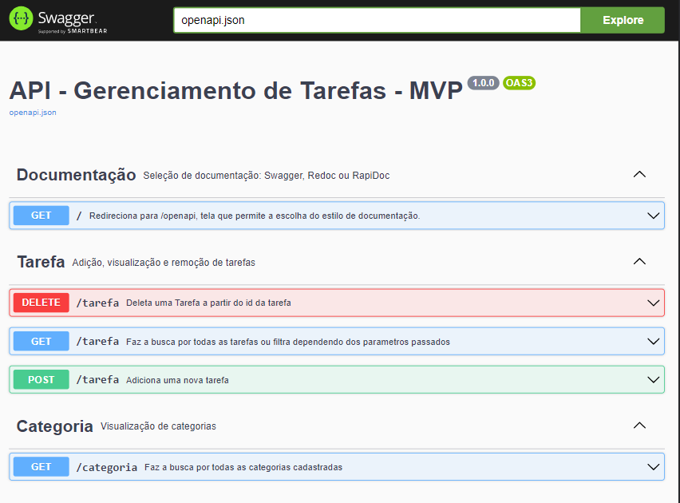

# Backend - Gerenciador de Tarefas




> Este backend foi desenvolvido como trabalho de conclusão do módulo basico da Pós-Graduação em Desenvolvimento FullStack da PUC-RIO. Ele foi desenvolvido em Python 3 junto com as bibliotecas Flask, SQLAlquemy e Pydantic.


## 💻 Pré-requisitos

Antes de começar, verifique se você atendeu aos seguintes requisitos:
<!---Estes são apenas requisitos de exemplo. Adicionar, duplicar ou remover conforme necessário--->
* Você instalou a versão 3 do `<Python>`
* Você tem uma máquina `<Windows / Linux / Mac>`. 

## 🚀 Instalando <Gerenciador de Tarefas>

Para instalar, siga estas etapas:

Clone ou faça download do projeto :
```
git clone https://github.com/bpbastos/backend-mvp-basico.git
```

Após clonar o repositório, será necessário fazer a instalação das dependencias da aplicação.
> É fortemente indicado o uso de ambientes virtuais do tipo [virtualenv](https://virtualenv.pypa.io/en/latest/installation.html).

```
(env)$ pip install -r requirements.txt
```

Este comando instala as dependências/bibliotecas, descritas no arquivo `requirements.txt`.

## ☕ Usando <Gerenciador de Tarefas>

Para usar, siga estas etapas:

No terminal execute o comando descrito abaixo para executar a API:

```
(env)$ flask run --host 0.0.0.0 --port 5000
```

Abra o http://localhost:5000/#/ no navegador para verificar o status da API em execução.
